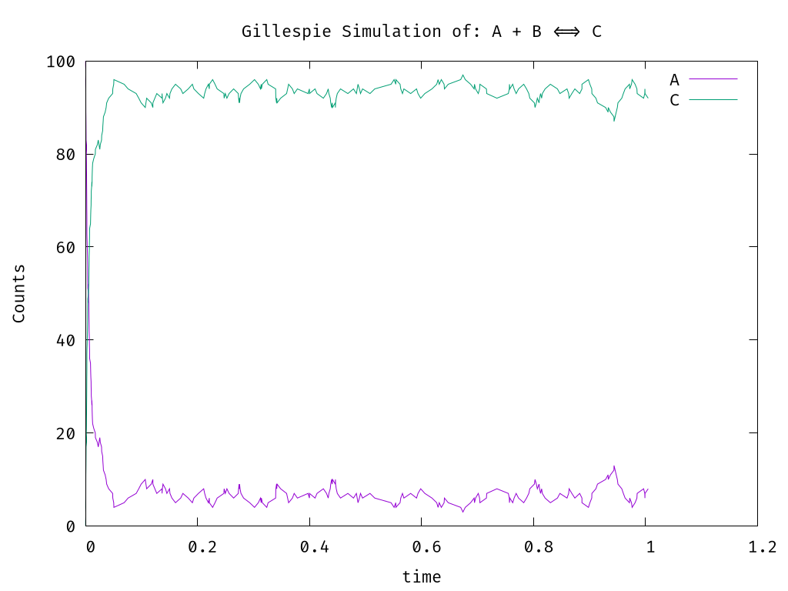

This is a simple C simulator for stochastic reaction models.

The goal is to eventually port this code into code callable by R, to have tight control on stochastic simulations within R.

In case we need the simulator to do a specific task that is not implemented in available packages, we can implement it here.

# Gillespie Algorithm

We implement the simplest form of the Gillespie algorithm:

1. Initialize time $t:=t_0$ and counts $x:=x_0$
2. Evaluate propensities $a=f(x)$ and sum them up $\sum_j a_j$
3. Generate two random numbers in $[0,1]$
   - derive time to next reaction $\tau$
   - derive which reaction to perform $j$
4. Change the system according to stoichiometry of reaction $j$
5. record counts $x$ and repeat until $t=t_f$

The example model, simulated in $t \in [0,1]$ produces this graph:

